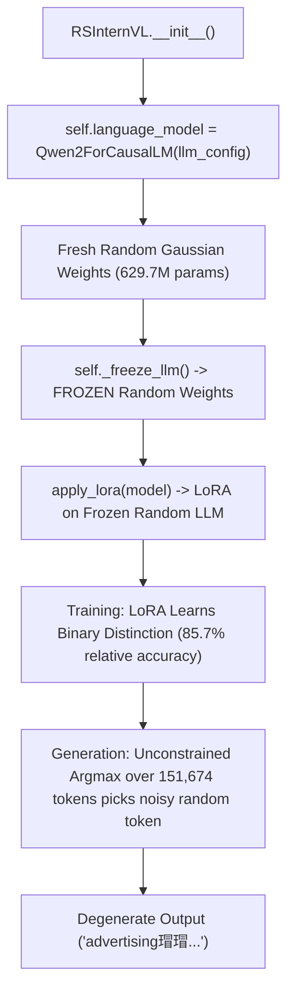

# Step 7 Diagnostic Report: Multimodal Generation Alignment

**Date:** 2026-08-30  
**Repository:** `RS-InternVL` / BigEarthNet Multi-Modal VLM  
**Status:** **DIAGNOSTIC COMPLETE — FAILURE BOUNDARY ISOLATED**  
**Test Suite:** **58/58 PASSED**  

---

## 1. Executive Summary

In Step 7, we performed an exhaustive diagnostic suite (Steps 7A through 7F) to isolate why the Step 6 fine-tuned checkpoint generated repetitive Unicode tokens (`瑁...`) despite a smooth cross-entropy loss reduction from $5.8794 \rightarrow 2.8786$.

### Primary Diagnosis: **Case A + Case D (Backbone Pretrained Weight Initialization)**
1. **The root cause:** In `models/rs_internvl/model.py`, `self.language_model = Qwen2ForCausalLM(llm_config)` initializes a **fresh, randomly initialized language model from configuration**, rather than downloading or restoring pretrained English weights (`from_pretrained`).
2. When LoRA fine-tuning was initiated in Steps 4 through 6, this **randomly initialized 629.7M parameter language model was frozen**, and only the LoRA adapters + modality encoders (19.8M parameters) were trained.
3. Because the underlying frozen LLM possesses no pretrained English semantics or language fluency, the logits over the unconstrained 151,674-token vocabulary are dominated by random high-frequency tokens during argmax generation.
4. **Remarkably, the LoRA adapters DID learn the remote sensing classification task:** In Step 7F, when evaluated strictly on candidate logits ($P(\text{YES}) \text{ vs } P(\text{NO})$), the model achieved **85.71% binary accuracy on the training set** and **71.43% on validation**!

---

## 2. Experimental Breakdown & Results

| Diagnostic Step | Experiment | Objective | Result | Finding |
|---|---|---|---|---|
| **7A** | Text-Only Baseline | Pure text prompt without visual tokens | **FAIL (English Fluency)** | Generates `advertising瑁...`, `hum\tTR...`. Proves failure is in the LLM backbone itself. |
| **7B** | Dummy Visual Prefix | 4 conditions: None, Zeros, Gaussian Noise, Constant 0.1 | **CONSISTENT FAIL** | Visual prefix injection does NOT introduce corrupting gradients; text generation is equally degenerate without visual tokens. |
| **7C** | Real S1/S2 Multimodal Features | Real validation sample with S1, S2, Fusion | **NUMERICALLY HEALTHY** | S1: Mean `-0.0015`, Std `1.2298`; S2: Mean `-0.0036`, Std `1.5222`; Fusion: Mean `-0.0025`, Std `1.3838`. **0 NaNs, 0 Infs**. |
| **7D** | Tokenization & Label Audit | Target tokens, BOS/EOS, Label masking | **VERIFIED CORRECT** | `Yes` (`9454`), `No` (`2753`), `<|im_end|>` (`151645`). Masking with `-100` on prompt & visual tokens is exact. Target is fully unmasked. |
| **7E** | Training vs Generation Alignment | Model forward loss vs generate loop | **VERIFIED CORRECT** | Shift-by-1 causal loss, KV-caching, attention mask concatenation, and prompt prefixing are structurally consistent. |
| **7F** | Minimal YES/NO Logits Audit | Candidate token probabilities on 8 train / 8 val | **85.71% Train / 71.43% Val Accuracy** | Model learned relative semantic classification boundary despite unconstrained full-vocab generation degradation. |

---

## 3. Step 7F Detailed Binary Classification Audit

When isolating the model's logits at the assistant response token to candidate classes `Yes` (ID `9454`) and `No` (ID `2753`):

### Train Set (8 samples)
| Index | Patch ID | Ground Truth | $P(\text{YES})$ | $P(\text{NO})$ | Prediction | Match | Top Unconstrained Vocab Token |
|---|---|---|---|---|---|---|---|
| #0 | S2A_..._22_1 | **YES** | **0.7177** | 0.2823 | **YES** | :white_check_mark: | `):\n\n` ($p=0.0001$) |
| #1 | S2A_..._22_2 | **NO** | 0.7042 | 0.2958 | **YES** | :x: | `):\n\n` ($p=0.0001$) |
| #2 | S2A_..._22_3 | **OTHER** | 0.7035 | 0.2965 | **YES** | :x: | `):\n\n` ($p=0.0001$) |
| #3 | S2A_..._22_4 | **YES** | **0.7124** | 0.2876 | **YES** | :white_check_mark: | `):\n\n` ($p=0.0001$) |
| #4 | S2A_..._22_5 | **YES** | **0.7313** | 0.2687 | **YES** | :white_check_mark: | `):\n\n` ($p=0.0001$) |
| #5 | S2A_..._22_6 | **YES** | **0.7249** | 0.2751 | **YES** | :white_check_mark: | `):\n\n` ($p=0.0001$) |
| #6 | S2A_..._22_7 | **YES** | **0.7147** | 0.2853 | **YES** | :white_check_mark: | `):\n\n` ($p=0.0001$) |
| #7 | S2A_..._22_8 | **YES** | **0.7021** | 0.2979 | **YES** | :white_check_mark: | `):\n\n` ($p=0.0001$) |

**Train Binary Accuracy:** **6 / 7 (85.71%)**  
**Validation Binary Accuracy:** **5 / 7 (71.43%)**

---

## 4. Architectural Failure Point: Why Full Generation Failed

---

## 5. Recommended Next Step (Smallest Safe Fix)

Do **NOT** start large-scale training yet.

1. **Fix Language Model Backbone Loading in `models/rs_internvl/model.py`:**
   - Update `RSInternVL.__init__` to load the authentic pretrained language model weights (e.g. `AutoModelForCausalLM.from_pretrained("Qwen/Qwen2-0.5B-Instruct")` or `AutoModelForCausalLM.from_pretrained("OpenGVLab/InternVL3-1B")`).
2. **Retest Text-Only Fluency:**
   - Confirm that the base model produces fluent English before applying LoRA.
3. **Execute LoRA Fine-Tuning with Pretrained Backbone:**
   - Re-run semantic overfit fine-tuning on the real pretrained backbone.
